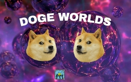

# DogeWorlds

A utility-first tool for worlds management

## Commands

| Command | Description | Usage | Permission |
| ------- | ----------- | ----- | ---------- |
| /dw help | Display the list of all the commands | | `dogeworlds.command`
| /dw create | Create a new world with generator and difficulty | `/dw create <world> <generator> [difficulty]` | `dogeworlds.command.create` |
| /dw delete | Delete a world | `/dw delete <world>`  | `dogeworlds.command.delete` |
| /dw list | List all loaded and unloaded worlds | `/dw list <world>`  | `dogeworlds.command.list` |
| /dw load | Load an unloaded world | `/dw load <world>`  | `dogeworlds.command.load` |
| /dw teleport | Teleport players to different worlds | `/dw teleport <world> [player]`  | `dogeworlds.command.teleport` |
| /dw unload | Unload a loaded world | `/dw unload <world> [force]`  | `dogeworlds.command.unload` |

## World Generators

DogeWorlds supports all the registered world generators within the GeneratorManager and a custom built-in Void
generator.
